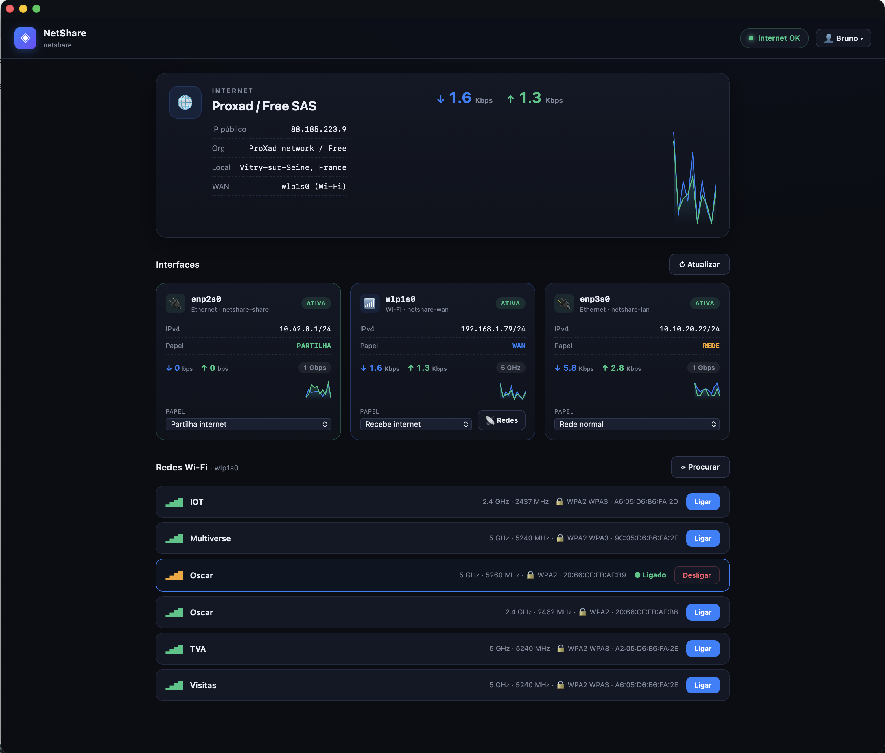

# NetShare — web panel for Wi-Fi internet sharing

**English** · [Português](README.pt.md)

<p align="center">
  
</p>

Turn a mini-PC running Ubuntu Server into a **backup gateway**: it picks up
the internet over **Wi-Fi** from another network and shares it over Ethernet
to your main router's secondary WAN port (e.g. WAN2 on a UniFi Dream
Machine). For anyone who wants **WAN redundancy** without paying for a
second internet line.

Instead of hand-editing `netplan`, `nftables` and `dnsmasq`, you assign a
role to each interface from a **UniFi-style web panel**:

- **"Internet" panel** with ISP, public IP, organization and location.
- **Live throughput** (↓/↑) per interface, with area charts.
- Real-time IPs and state of every interface.
- Wi-Fi scanner by BSSID/band and 1-click connect.
- Bilingual **Portuguese / English** with browser auto-detection.

> **Demo mode:** opening `static/index.html` in a browser, with no backend,
> shows animated fake data — just to preview the look.

---

## Quick install (over SSH)

Prerequisites:

- **Ubuntu Server** installed, SSH working.
- **Temporary Ethernet cable with internet** during setup (to pull packages
  and install drivers if needed).

### Standard install

For most machines (Wi-Fi cards from Intel, Realtek, MediaTek, Atheros, or
Broadcom supported by the open `brcmfmac` driver). Over SSH:

```bash
# 1) Clone NetShare2
git clone https://github.com/soundflow-dev/NetShare2.git
cd NetShare2

# 2) Universal system preparation (NetworkManager, iw, ...)
sudo ./bootstrap.sh && sudo reboot
```

After the reboot, reconnect over SSH and:

```bash
# 3) Install the panel and the management route mechanism
cd NetShare2
sudo ./install.sh && sudo systemctl restart netshare
```

Open **`http://<management-IP>:8088`** in your browser. On the first access
the panel will ask you to create a username + password — there are no
default credentials.

### Recommended recipe for Broadcom BCM43xx

If you are reinstalling from scratch on a machine with a Broadcom BCM43xx/Fenvi
card that needs the proprietary `wl` driver, use this order:

```bash
git clone --branch v1.0.4 https://github.com/soundflow-dev/NetShare2.git
cd NetShare2

sudo ./broadcom-wl-setup.sh
sudo ./bootstrap.sh
sudo reboot
```

After the reboot:

```bash
cd ~/NetShare2
sudo ./install.sh
sudo systemctl restart netshare
```

In the panel, set the Broadcom Wi-Fi card to **Receives internet**, choose the
**5 GHz** row for your SSID in the scanner, set the Ethernet cable to the
router/WAN2 as **Shares internet**, and set the management Ethernet as
**Local network**. For dual-band networks with the same SSID, also install the
5 GHz watchdog:

```bash
cd ~/NetShare2
sudo install -m755 wan-watchdog.sh /opt/netshare/wan-watchdog.sh
sudo cp netshare-wan-watchdog.service /etc/systemd/system/
sudo cp netshare-wan-watchdog.timer /etc/systemd/system/
sudo systemctl daemon-reload
sudo systemctl enable --now netshare-wan-watchdog.timer
```

### Special case: Broadcom BCM43xx Wi-Fi card

Some Wi-Fi cards use a Broadcom **BCM43xx** chip that is not supported by
the Linux mainline (typical of "Fenvi" / "OS-X-compatible" /
"Hackintosh-ready" cards — models with BCM4360, BCM4352, BCM4364, BCM43224,
etc.). These need the proprietary driver **`broadcom-sta-dkms`** (`wl`),
shipped by Broadcom, installed through DKMS.

**How to tell whether this is your case:**
```bash
lspci -nn | grep -i 'network\|wireless'
```
If the output shows a line "**Broadcom Inc. ... BCM43xx**" and the Wi-Fi
does not appear in `nmcli device status` after `bootstrap.sh`, you need
this step.

**How to install (run BEFORE `bootstrap.sh`):**

```bash
git clone https://github.com/soundflow-dev/NetShare2.git
cd NetShare2

# 0) BEFORE bootstrap — install the proprietary Broadcom driver
sudo ./broadcom-wl-setup.sh

# 1+2+3) Rest is the same as the standard install
sudo ./bootstrap.sh && sudo reboot
# after the reboot:
cd NetShare2
sudo ./install.sh && sudo systemctl restart netshare
```

**Why this extra step:**
- Broadcom's `wl` driver is not in the mainline → it's installed via **DKMS**
  (rebuilt on every kernel update).
- The open drivers (`b43`, `bcma`, `brcmfmac`) compete for the same card at
  boot → the script **blacklists** them to force the use of `wl`.
- `wl` has historically broken in new kernels without warning → the script
  **pins the kernel** (`apt-mark hold`) so `apt upgrade` does not pull a
  version that breaks Wi-Fi without you noticing.

If you ever want to upgrade the kernel, release the hold with:
```bash
sudo apt-mark unhold linux-image-generic linux-headers-generic linux-generic
```
but do it with the **management port reachable** (monitor or guaranteed
SSH), in case Wi-Fi breaks on the new kernel.

> Not sure whether your card needs this? Do the standard install first. If
> the Wi-Fi does not appear in `nmcli device status` after the reboot, run
> `broadcom-wl-setup.sh` and reboot again.

> Don't have Ubuntu Server installed yet? The guide
> [`SETUP-FROM-SCRATCH.md`](SETUP-FROM-SCRATCH.md) walks you through
> everything from scratch, including cabling and role assignment.

---

## Assign roles to the interfaces (in the panel)

After creating the account, you assign each interface's role in the panel:

| Role | What it's for | What the panel does (via nmcli) |
|---|---|---|
| **Receives internet** (WAN) | Card that connects to the network providing internet | Wi-Fi: joins the chosen network; Ethernet: standard DHCP; supplies the default route |
| **Shares internet** | Output to the router/devices | Ethernet or Wi-Fi AP with `ipv4.method shared` → automatic NAT + DHCP (`10.42.0.1/24`) |
| **Local network** | Management/SSH cable | Standard DHCP, but `ipv4.never-default yes` (never becomes egress) |
| **Inactive** | Bring the interface down | — |

> Wi-Fi sharing is only available on cards whose chip/driver supports **AP
> mode**. Broadcom BCM43xx with the proprietary `wl` driver usually works as a
> WAN client, but not as a hotspot; use Ethernet for sharing in those cases.

---

## What each script does

### `bootstrap.sh` (universal — always run)
- Switches the **netplan** renderer to **NetworkManager** (required for
  Wi-Fi scan and *shared* mode — Ubuntu Server's `systemd-networkd` does
  neither).
- Disables cloud-init's network config (so it doesn't rewrite netplan at
  boot).
- Installs **`iw`** (used to read the current Wi-Fi band, detect AP mode, and by the watchdog).
- Disables `wait-online` (saves ~150 s at boot).

### `broadcom-wl-setup.sh` (only if you have a Broadcom BCM43xx card)
- Installs **`broadcom-sta-dkms`** (the proprietary `wl` driver).
- **Blacklists** the conflicting open drivers (`b43`, `bcma`, `brcmsmac`,
  `brcmfmac`, ...).
- **Pins the kernel** (`apt-mark hold`) — `wl` rebuilds on every update and
  often breaks in new kernels.

### `install.sh` (next, in either case)
- Copies the panel into `/opt/netshare/` and starts the service.
- Installs the **management return-route mechanism** (keeps SSH alive when
  Wi-Fi takes over the default route — see below).
- Pins `ip_forward=1` persistently (so sharing works).

Everything is idempotent and safe to run more than once.

---

## How the management routing works (keeps SSH alive)

The big risk in a setup like this: once Wi-Fi takes the default route to
feed the sharing, the gateway's replies to an administrator **on a different
subnet** (typical in VLAN-segmented networks) try to leave through Wi-Fi
and SSH dies. We solve it with a **more-specific return route** for the
management network, via the management gateway, in the main table.

`install.sh` automatically installs:

- **`mgmt-route.sh`** — a script that reads management interface, IP and
  gateway in real time (via `nmcli`, no hard-coded IPs) and adds the
  more-specific route. Works on any machine/network.
- **`netshare-mgmt-route.service`** — oneshot service that runs the script
  at boot (with retries until the network is ready).
- **`dispatcher/90-netshare-mgmt`** — NetworkManager dispatcher that
  re-applies the route whenever the `netshare-lan` (local network)
  connection comes up.

Two mechanisms, to make sure SSH survives any reboot.

---

## Optional: Wi-Fi WAN watchdog (force 5 GHz after reconnect)

> **When do you need this?** If your WAN is a dual-band Wi-Fi (same SSID on
> both **2.4 GHz** and **5 GHz**) and the upstream router **goes down and
> comes back** (e.g. nightly reset, power outage, scheduled standby),
> NetworkManager's autoconnect tends to grab the BSSID with the strongest
> signal first — almost always the **2.4 GHz** one — even with `wifi.band a`
> in the profile. WAN stays on the slow band until someone forces a
> reconnect.
>
> This optional watchdog does that automatically: every 1 minute it checks
> whether `netshare-wan` is pinned to a 5 GHz BSSID. If it is already on
> 5 GHz, it pins the current BSSID. If it is on 2.4 GHz, it finds the best
> 5 GHz BSSID for the current SSID, pins that BSSID in the profile, and
> forces a `down/up`. This is more robust than using only `wifi.band a`,
> because some APs/drivers roam back to the 2.4 GHz BSSID.

If this is NOT your case, **skip this section** — you don't need it.

### See which band the WAN is on right now (no install needed)

```bash
freq=$(sudo iw dev wlp1s0 link | awk '/freq:/ {print $2}' | cut -d. -f1)
if   [ -z "$freq" ];        then echo "WAN not connected"
elif [ "$freq" -lt 3000 ];  then echo "WAN on 2.4 GHz (freq $freq MHz)"
elif [ "$freq" -lt 6000 ];  then echo "WAN on 5 GHz (freq $freq MHz)"
else                              echo "WAN on $freq MHz"
fi
```

(replace `wlp1s0` with the name of your Wi-Fi card if different)

### Install (from the repo folder)

```bash
sudo install -m755 wan-watchdog.sh /opt/netshare/wan-watchdog.sh
sudo cp netshare-wan-watchdog.service /etc/systemd/system/
sudo cp netshare-wan-watchdog.timer   /etc/systemd/system/
sudo systemctl daemon-reload
sudo systemctl enable --now netshare-wan-watchdog.timer
```

### Check it's active

```bash
# is the timer enabled and when does it fire next?
systemctl list-timers netshare-wan-watchdog.timer --no-pager

# logs (empty = never had to act, which is a good sign)
sudo journalctl -t netshare-wan-watchdog -n 20 --no-pager

# run one check right now (without waiting for the timer)
sudo /opt/netshare/wan-watchdog.sh
```

When the watchdog acts, you'll see something like this in `journalctl`:
```
WAN on 2.4 GHz (2412 MHz) — pinned 5 GHz BSSID aa:bb:cc:dd:ee:ff for SSID 'MyNetwork'
after reconnect: 5 GHz (5260 MHz)
```

### Uninstall (if you ever want to remove it)

```bash
sudo systemctl disable --now netshare-wan-watchdog.timer
sudo rm /etc/systemd/system/netshare-wan-watchdog.service
sudo rm /etc/systemd/system/netshare-wan-watchdog.timer
sudo rm /opt/netshare/wan-watchdog.sh
sudo systemctl daemon-reload
```

Confirm with:
```bash
systemctl status netshare-wan-watchdog.timer 2>&1 | head -3
# should say "Unit netshare-wan-watchdog.timer could not be found." → removed OK
```

### Note

The panel also passes the selected BSSID when joining a Wi-Fi network. If you
choose the 5 GHz entry in the scanner, the profile is pinned to that AP. The
watchdog reinforces that after reboots/reconnects. To clear that BSSID manually:

```bash
sudo nmcli connection modify netshare-wan 802-11-wireless.bssid ""
```

---

## Security — please read

- The panel runs **as root** (it reconfigures the network). Treat it as
  privileged access.
- Authentication via **session (cookie)**: on the first access you create
  username+password in the panel; the password is stored with a **PBKDF2
  hash** in `/etc/netshare/auth.json` (never in plain text). You change the
  password in the account menu. To reset (if forgotten), delete
  `auth.json` and reload the panel — it returns to the account-creation
  screen.
- **Don't expose this to the internet or to the upstream Wi-Fi (WAN).**
  Keep it accessible only from the management network. Recommended firewall
  restriction, e.g.:
  ```bash
  sudo ufw allow from 10.10.0.0/16 to any port 8088 proto tcp
  ```
  (adjust to your management subnet). Ideally, change `host` in
  `config.json` to the management interface IP instead of `0.0.0.0`.
- HTTP is in the clear. For a local management network this is acceptable;
  if you want TLS, put a reverse-proxy in front later.
- **ISP identification** sends a request to `ip-api.com` (free third-party
  service, no API key) to discover the public IP and the WAN provider —
  that's one HTTP request from the gateway every 10 minutes (cached). If
  you don't want that external call, just don't use the `/api/isp` endpoint
  (or remove it from `app.py`); the rest of the panel works just the same.

---

## Files

```
app.py                            backend (stdlib + nmcli)
static/index.html                 generated UI (self-contained)
static/app.js                     frontend logic
static/style.css                  styles
build.py                          generates the self-contained index.html

netshare.service                  systemd unit for the panel
config.example.json               configuration template

bootstrap.sh                      prepares the OS (NetworkManager + iw, universal)
broadcom-wl-setup.sh              optional, only for Broadcom BCM43xx cards
install.sh                        installs panel + management route

mgmt-route.sh                     re-applies the management return route
netshare-mgmt-route.service       wraps the script above at boot
dispatcher/90-netshare-mgmt       re-applies the route when netshare-lan comes up

# optional — only if you need it (see the WAN watchdog section):
wan-watchdog.sh                   forces netshare-wan to 5 GHz if it drops to 2.4
netshare-wan-watchdog.service     oneshot that runs the script
netshare-wan-watchdog.timer       fires the service every 1 min
```

---

## Status

Validated in production on a mini-PC running Ubuntu Server (Broadcom BCM4360
Wi-Fi card + 2× Realtek Ethernet): automatic bootstrap, panel deployed, NAT
sharing feeding the WAN2 of a Dream Machine, survives a clean reboot
(management return route is re-applied at boot), and complete reinstall
from scratch confirmed via a fresh clone.
